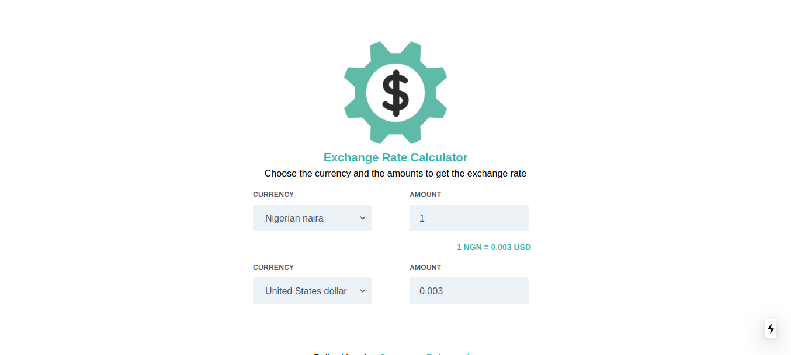

# 💱 Currency Exchanger – Next.js

A sleek and responsive currency exchange rate calculator built with **Next.js**, styled using **Tailwind CSS**, and enhanced with **PWA capabilities**.

---

## 📸 Design Preview



---

## 🚀 Tech Stack

This app was built using the following technologies:

- ⚛️ React  
- 🌬 Tailwind CSS  
- ⚡ Next.js  
- 📲 Next PWA  
- ⌨️ React Typed  

---

## 📦 Getting Started

### 1. Clone the Repository

```bash
git clone https://github.com/your-username/currency-exchanger.git
cd currency-exchanger
